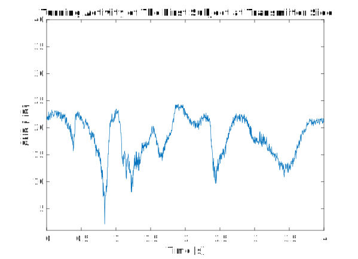
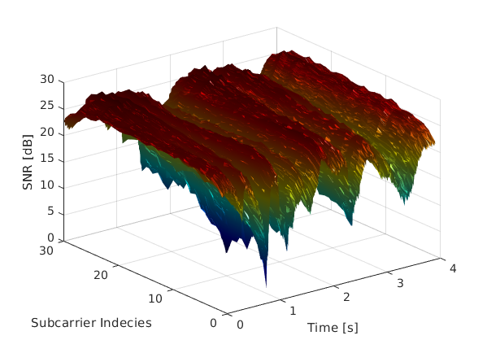

# A dataset for Wi-Fi-based human activity recognition in LOS and NLOS indoor environments

This repository contains the data and the code that enables you to read the signals values.
    
## MAT and DAT with The Files Structure 

The data that was published in the [article](https://www.sciencedirect.com/science/article/pii/S2352340920314165) is a CSV formatted data 
that you need to import it back into MATLAB to be processed and cliabrated by Linux 802.11n CSI tool supplements files.
Neverthless, you can simply use the MAT and DAT files that are exist in this repository.
The MAT files are simply the parsing of the DAT files into matlab using `read_bf_file` script, so it is up to you whether to use the MAT or DAT files. 
The DAT files were uploaded for any future changes on the calibration and processing codes if any researcher needs to do such a thing!
Anyway, the data structure description and information can be found in the [paper](https://www.sciencedirect.com/science/article/pii/S2352340920314165).

## Reading Amplitude Data

I've provided a simple script to read and parse the signal amplitude from the data. 

#### MAT files

```matlab
% This code will plot the first subcarrier data from the first stream.

load('MAT/E1/E1_S01_C03_A09_T01.mat');
activity = get_amplitude_sig_mat(data);
plot(activity.timestamp, activity.stream1(:, 1));
title('Turning Activity of The First Subject at Transmiiter Side');
xlabel('Time [s]');
ylabel('SNR [dB]');
ylim([1 40]);
```

#### DAT files 
```matlab
% This code will plot the first subcarrier data from the first stream.

activity = get_amplitude_sig('DAT/E1/E1_S01_C03_A09_T01.dat');
plot(activity.timestamp, activity.stream1(:, 1));
title('Turning Activity of The First Subject at Transmiiter Side');
xlabel('Time [s]');
ylabel('SNR [dB]');
ylim([1 40]);
```

#### 3D Plotting 
```matlab
% Plotting the first stream data as 3D where the third dimention is the subcarrier.

load('MAT/E1/E1_S01_C03_A09_T01.mat');
activity = get_amplitude_sig_mat(data);

[x, y] = meshgrid(activity.timestamp, 1:30);
z = [activity.stream1];

% Plot
surf(x.', y.', z);
xlabel("Time [s]");
ylabel("Subcarrier Indecies");
zlabel("SNR [dB]");
colormap('jet');
camlight right;
shading interp;
```





## Papers
<a id="3">[3]</a> 
Alsaify BA, Almazari MM, Alazrai R, Alouneh S, Daoud MI. A CSI-Based Multi-Environment Human Activity Recognition Framework. Applied Sciences. 2022; 12(2):930. https://doi.org/10.3390/app12020930

<a id="2">[2]</a> 
B. A. Alsaify, M. M. Almazari, R. Alazrai and M. I. Daoud, "Exploiting Wi-Fi Signals for Human Activity Recognition," 2021 12th International Conference on Information and Communication Systems (ICICS), 2021, pp. 245-250, doi: 10.1109/ICICS52457.2021.9464613.

<a id="1">[1]</a> 
Baha’ A. Alsaify, Mahmoud M. Almazari, Rami Alazrai, Mohammad I. Daoud, A dataset for Wi-Fi-based human activity recognition in line-of-sight and non-line-of-sight indoor environments, Data in Brief, Volume 33, 2020, 106534, ISSN 2352-3409, https://doi.org/10.1016/j.dib.2020.106534.

## Notes: 
- The original code (i.e. dhalperi_suppl directory) can be found at [Linux 802.11n CSI Tool](https://github.com/dhalperi/linux-80211n-csitool-supplementary)
- Guide on CSI values calibration, processing and readings can be found at [How do I process CSI with MATLAB or Octave?](https://dhalperi.github.io/linux-80211n-csitool/faq.html)
- More information can be found at Dr. Dan Halperin website for the [Linux 802.11n CSI Tool](https://dhalperi.github.io/linux-80211n-csitool/index.html)
